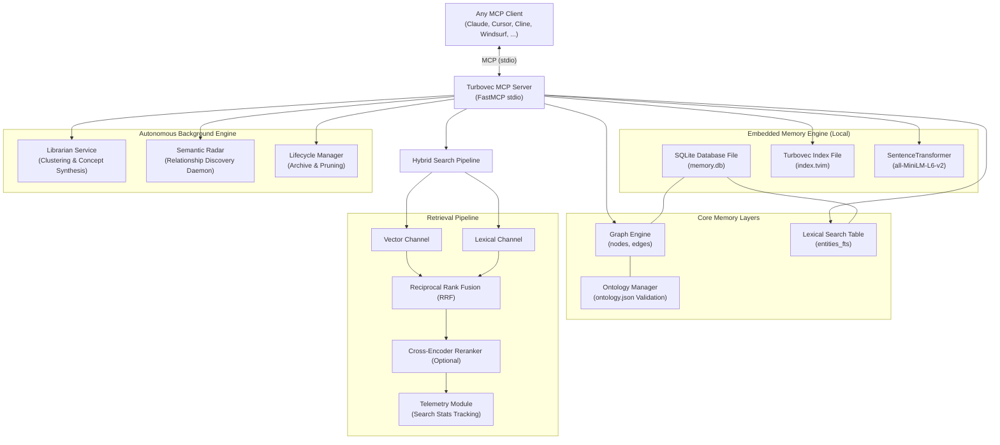

# Turbovec MCP: Embedded Hybrid Graph-Vector-Lexical Memory System

Turbovec MCP Server is an enterprise-grade, local-first **Model Context Protocol (MCP)** implementation that serves as an advanced, persistent, transaction-safe, and self-organizing long-term memory for AI coding assistants (such as **Cursor**, **Claude Desktop**, **Cline / Roo Code**, **Windsurf**, and **Zoo Code**).

By combining **in-process SQLite graph storage**, **SQLite FTS5 full-text search**, and the high-performance **`turbovec` vector index**, Turbovec MCP provides your AI assistant with the ability to "remember," "associate," "traverse," and "synthesize" complex knowledge webs across multiple chat sessions—completely bypassing standard token context window limits.

---

## The Problem it Solves

1. **Context Window Exhaustion**: Pasting thousands of lines of code or entire folders into active chat threads is expensive, degrades reasoning, and eventually overflows token limits.
2. **AI Amnesia (Stateless Sessions)**: When you close a chat window, your AI assistant forgets everything—architectural decisions, custom guidelines, preference notes, and session takeaways.
3. **Keyword Search vs. Semantic Search**: Normal keyword matching (like `grep` or `CTRL+F`) fails when queries do not match source text exactly. Turbovec resolves this by combining keyword, vector similarity, and relational graph context.
4. **Information Decay & Fragmentation**: Over time, stored memories become disconnected, orphaned, or stale. Turbovec introduces an autonomous background engine that continuously clusters, deduplicates, and prunes memories.

---

## Architecture & Memory Flow

Turbovec operates fully in-process inside your local workspace. All operations are atomic, local, and private.



> *For a detailed look at the storage schema, database tables, and metrics structures, see the [Configuration Guide](docs/configuration.md).*

---

## Quick Start (Local Setup)

Get Turbovec MCP up and running on your machine in under a minute:

1. **Clone the Repository**:
   ```bash
   git clone https://github.com/henny-bee/Turbovec-MCP-Server.git
   cd turbovec-mcp-server
   ```

2. **Set Up a Virtual Environment & Install Dependencies**:
   ```bash
   python -m venv venv
   
   # Windows:
   .\venv\Scripts\activate
   # Mac/Linux:
   source venv/bin/activate

   pip install -r requirements.txt
   ```

3. **Verify Server Execution**:
   ```bash
   python main.py
   ```
   *You should see a clean start log in `server.log`. Raw console progress bars are suppressed to keep MCP stdio communication clean.*

---

## Documentation Map

To keep this manual organized and easy to digest, detailed reference materials and configuration steps have been separated into focused guides:

*   **[Configuration & Setup Guide](docs/configuration.md)** — Detailed environment variables, database schema explanation, developer dashboard, Docker-compose setup, and editor integrations (Claude Desktop, Cursor, Cline/Roo Code).
*   **[MCP Tools Reference Manual](docs/tools_reference.md)** — Complete categorized documentation for all **35 powerful MCP tools and prompts** (CRUD, Hybrid Search, Temporal travel, Semantic Radar, Librarian, Bottles).
*   **[Custom Instructions & Rules](docs/custom_instructions.md)** — Recommended custom instructions and system rules for your AI assistant to leverage Turbovec proactively.

---

## Testing

The repository includes a comprehensive, 43-point unit and integration test suite using `pytest` to verify graph consistency, transactional rollbacks, hybrid search scoring, and background daemon workers.

1. **Install Development Requirements**:
   ```bash
   pip install -r requirements-dev.txt
   ```

2. **Run Tests**:
   ```bash
   pytest
   ```

---

## 📄 License

This project is licensed under the MIT License. See the [LICENSE](LICENSE) file for details.

---

[](https://lobehub.com/mcp/henny-bee-turbovec-mcp-server)
[](https://glama.ai/mcp/servers/henny-bee/Turbovec-MCP-Tiar)

**Sponsored by**

<a href="https://www.iseekaigo.com/">
  
</a>
