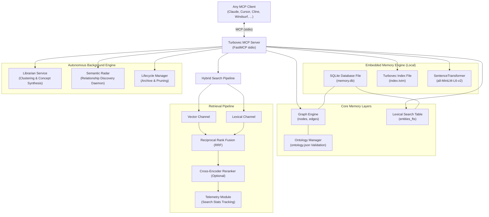

[](https://lobehub.com/mcp/henny-bee-turbovec-mcp-server)
# Turbovec MCP: Embedded Hybrid Graph-Vector-Lexical Memory System

Turbovec MCP Server is an enterprise-grade, local-first **Model Context Protocol (MCP)** implementation that serves as an advanced, persistent, transaction-safe, and self-organizing long-term memory for AI coding assistants (such as **Cursor**, **Claude Desktop**, **Cline / Roo Code**, **Windsurf**, and **Zoo Code**).

By combining **in-process SQLite graph storage**, **SQLite FTS5 full-text search**, and the high-performance **`turbovec` vector index**, Turbovec MCP provides your AI assistant with the ability to "remember," "associate," "traverse," and "synthesize" complex knowledge webs across multiple chat sessions—completely bypassing standard token context window limits.

---

## The Problem it Solves

1. **Context Window Exhaustion**: Pasting thousands of lines of code or entire folders into active chat threads is expensive, degrades reasoning, and eventually overflows token limits.
2. **AI Amnesia (Stateless Sessions)**: When you close a chat window, your AI assistant forgets everything—architectural decisions, custom guidelines, preference notes, and session takeaways.
3. **Keyword Search vs. Semantic Search**: Normal keyword matching (like `grep` or `CTRL+F`) fails when queries do not match source text exactly. Turbovec resolves this by combining keyword, vector similarity, and relational graph context.
4. **Information Decay & Fragmentation**: Over time, stored memories become disconnected, orphaned, or stale. Turbovec introduces an autonomous background engine that continuously clusters, deduplicates, and prunes memories.

---

## Architecture & Memory Flow

Turbovec operates fully in-process inside your local workspace. All operations are atomic, local, and private.



### Storage Layer Schema
1. **`nodes` Table**: Stores entities, sessions, breakthroughs, and files with metadata, certainty ratings (`speculative`, `confirmed`, etc.), salience scores, and lifecycle statuses (`ACTIVE`, `ARCHIVED`).
2. **`edges` Table**: Represents directed, typed, and weighted relationships (e.g., `DEPENDS_ON`, `PRECEDED_BY`, `IMPLEMENTS`) connecting nodes.
3. **`observations` Table**: Holds localized facts, takeaways, or content blocks associated with specific entity nodes, keeping search payloads clean and highly searchable.
4. **`entities_fts` Table**: A Porter Stemmer-powered Unicode virtual table inside SQLite for highly efficient lexical keyword matches.
5. **`vector_id_mapping` Table**: Bridges UUID string graph identifiers with deterministic, collision-resistant signed 64-bit integer index keys required by `turbovec`.
6. **`bottles` Table**: Persists inter-session messaging notes left by agents to coordinate instructions across independent sessions.
7. **`search_metrics` Table**: Collects latency metrics per subsystem (FTS, vector search, graph hydration, embedding generation, reranker) and error flags for full search telemetry.

---

## Key Features & Advantages

- **Zero-Dependency & In-Process**: Runs entirely locally on your machine without requiring heavy external database services (like Qdrant, Milvus, FalkorDB, or Neo4j).
- **Consolidated Hybrid Memory**: Seamlessly unifies structured **entity graphs**, unstructured **text/code chunks**, and relational **factual observations** under a single storage engine.
- **Fail-Loud Operational Reliability**: Distinguishes between "no match found" and "system failure" using a unified `SearchError` with machine-readable error codes. Includes a strict **write-compensation rollback pattern** to keep SQLite and the vector index fully in sync on failure.
- **Advanced Hybrid Search & Reranking**: Fuses retrieval results from Vector (SentenceTransformers) and Lexical (FTS5) channels using **Reciprocal Rank Fusion (RRF)**, with optional high-precision **Cross-Encoder Reranking**.
- **Temporal Memory & Point-in-Time Queries**: Full snapshot capability (`point_in_time_query`), chronological event timelines (`query_timeline`), historical graph diffing (`diff_knowledge_state`), and temporal neighbor traversal.
- **Autonomous Librarian Engine**: A background worker (and on-demand tool) that leverages **DBSCAN Clustering** to group related concepts, detect duplicates, and synthesize higher-order concepts with transparent provenance logs.
- **Dynamic Ontology Validation**: Enforces structured schemas for entity nodes and relationship edges defined in a configurable `ontology.json` file.
- **Memory Lifecycle & Active Archiving**: Prevents historical clutter from degrading retrieval performance by moving inactive entities through a lifecycle status chain: `ACTIVE` → `STALE` → `ARCHIVED` → `PRUNED`.
- **Inter-Session Messaging (Bottles)**: Standardized message bottles (`create_bottle`, `get_bottles`, `acknowledge_bottle`) left by agents to coordinate work across independent chat sessions.
- **Graph Analytics Suite**: Evaluates graph topology on-demand to compute Degree Centrality, PageRank, Connected Components, and Label Propagation Algorithm (LPA) Community Detection.
- **Interactive Developer Dashboard**: A full-featured, lightweight **Streamlit dashboard** (`dashboard/app.py`) to visualize graph topologies, community counts, rolling telemetry percentiles (P50, P95, P99), active bottles, and Librarian logs.

---

## Configuration & Environment Variables

The server and background workers can be configured via environment variables on startup:

| Variable | Type | Default | Description |
| :--- | :--- | :--- | :--- |
| `BACKGROUND_DISCOVERY` | Boolean | `false` | Enables/disables the background semantic relationship discovery worker. |
| `BG_DISCOVERY_INTERVAL`| Integer | `300` | Loop interval in seconds for the background relationship worker. |
| `BG_DISCOVERY_THRESHOLD`| Float | `0.7` | Cosine similarity threshold for automatic background edge inferences. |
| `SQLITE_DB_FILE` | String | `memory.db` | Path to the SQLite metadata and graph database. |
| `PYTHONUNBUFFERED` | String | `1` | Ensures python outputs are flushed immediately, avoiding JSON-RPC deadlocks. |

---

## Installation & Setup

You can run Turbovec MCP Server locally using a standard Python environment or via Docker.

### Option A: Local Python Setup (Recommended)

1. **Clone the Repository**:
   ```bash
   git clone https://github.com/henny-bee/Turbovec-MCP-Server.git
   cd turbovec-mcp-server
   ```

2. **Create and Activate a Virtual Environment**:
   ```bash
   python -m venv venv

   # Windows
   .\venv\Scripts\activate
   # Mac/Linux
   source venv/bin/activate
   ```

3. **Install Dependencies**:
   ```bash
   pip install -r requirements.txt
   ```

4. **Verify Server Execution**:
   ```bash
   # Windows
   .\venv\Scripts\python.exe main.py
   # Mac/Linux
   ./venv/bin/python main.py
   ```
   *You should see a clean start log in `server.log`. The command suppresses raw console progress bars to keep MCP stdio communication clean.*

---

### Option B: Docker Setup

1. **Clone the Repository**:
   ```bash
   git clone https://github.com/henny-bee/Turbovec-MCP-Server.git
   cd turbovec-mcp-server
   ```

2. **Run with Docker Compose**:
   ```bash
   docker-compose up -d
   ```
   *This starts the server inside a container and mounts the persistent volume `turbovec_data` to protect the database files (`memory.db` and `index.tvim`).*

---

### Option C: Developer Dashboard Setup

To run the interactive developer dashboard for visualizing graph schemas, latencies, and telemetry logs:

1. **Install Streamlit & Pandas**:
   ```bash
   pip install streamlit pandas
   ```

2. **Launch the Dashboard**:
   ```bash
   streamlit run dashboard/app.py
   ```
   *This spins up a local web server (usually at `http://localhost:8501`) connected directly to your local `memory.db` file.*

---

## 🔌 Editor & AI Client Configuration

To integrate Turbovec with your preferred AI environment, add the following to your local MCP server configuration settings (typically located in your global `mcp_settings.json` file or editor preferences).

### 1. Claude Desktop Setup
Modify your `%APPDATA%/Claude/claude_desktop_config.json` (Windows) or `~/Library/Application Support/Claude/claude_desktop_config.json` (Mac):

```json
{
  "mcpServers": {
    "turbovec-mcp": {
      "command": "C:/path/to/turbovec-mcp-server/venv/Scripts/python.exe",
      "args": [
        "C:/path/to/turbovec-mcp-server/main.py"
      ],
      "env": {
        "PYTHONUNBUFFERED": "1",
        "BACKGROUND_DISCOVERY": "true",
        "BG_DISCOVERY_INTERVAL": "300"
      }
    }
  }
}
```

### 2. Cursor Setup
Go to **Settings > Features > MCP**, click **Add New MCP Server**:
- **Name**: `turbovec-mcp`
- **Type**: `command`
- **Command**: `C:/path/to/turbovec-mcp-server/venv/Scripts/python.exe` (on Windows) or `/path/to/venv/bin/python` (on Mac/Linux)
- **Args**: `["C:/path/to/turbovec-mcp-server/main.py"]`

### 3. Cline / Roo Code Setup
Modify your system's Cline MCP settings file (`%APPDATA%/Code/User/globalStorage/saoudrizwan.claude-dev/settings/cline_mcp_settings.json` on Windows):

```json
{
  "mcpServers": {
    "turbovec-mcp": {
      "command": "python",
      "args": ["C:/absolute/path/to/turbovec-mcp-server/main.py"],
      "env": {
        "PYTHONUNBUFFERED": "1"
      },
      "disabled": false
    }
  }
}
```
> **Troubleshooting Tip**: If you get `ModuleNotFoundError` during setup, your editor is calling the global system Python instead of your virtual environment. Resolve this by specifying the absolute path of your venv's Python executable as the `"command"` property (e.g. `C:/turbovec-mcp-server/venv/Scripts/python.exe`).

---

## Available MCP Tools & Prompts

Once configured, your AI assistant will gain access to **35 powerful tools and prompts** split across memory categories:

### Unstructured Knowledge Tools
- `add_knowledge(title: str, content: str)`: Chunk, embed, and store unstructured documents or code snippet texts in the vector memory index.
- `add_file_knowledge(file_path: str)`: Reads a local file, chunks it, and indexes it for semantic search.
- `delete_knowledge(title_or_id: str)`: Removes a document chunk from the index and database matching a specific title or ID.
- `search_knowledge(query: str, top_k: int = 3)`: Performs vector-similarity search over raw chunked text.

### 🕸️ Graph Memory Core CRUD Tools
- `create_entity(id: str, name: str, node_type: str, properties: dict = None, project_id: str = "default")`: Creates a structured entity node in the graph, validating it against `ontology.json`.
- `add_observation(entity_id: str, content: str, project_id: str = "default")`: Attaches a factual observation, take-away, or note to an existing entity and triggers immediate indexing.
- `create_relationship(from_node_id: str, to_node_id: str, relationship_type: str, weight: float = 1.0, properties: dict = None, project_id: str = "default")`: Creates a typed, weighted directed edge, validating types against `ontology.json`.
- `delete_entity(id: str, project_id: str = "default")`: Deletes an entity node from the graph, cascading deletions automatically to edges and mappings.
- `delete_relationship(from_node_id: str, to_node_id: str, relationship_type: str, project_id: str = "default")`: Removes a relationship edge from the database.

### Graph Exploration & Context Tools
- `get_hologram(node_id: str, depth: int = 1)`: Returns a complete context block containing the node's properties, all attached observations, and adjacent neighbors (ideal context formatting for LLMs).
- `get_neighbors(node_id: str, depth: int = 1)`: Returns a simple list of connected nodes starting from an anchor node.

### Hybrid Search & Reranking
- `search_memory(query: str, limit: int = 10, project_id: str = "default", channel_weights: dict = None)`: Executes an enterprise hybrid (Vector + FTS5) search using **RRF**, and optional CrossEncoder Reranking.

### Temporal Session & "Time-Travel"
- `start_session(session_id: str, name: str, properties: dict = None, project_id: str = "default")`: Starts a temporal session, creating a session node and linking it to any prior closed session.
- `end_session(session_id: str, summary: str, project_id: str = "default")`: Closes a session, saving a summary markdown block and changing its status to closed.
- `record_breakthrough(session_id: str, title: str, content: str, project_id: str = "default")`: Records a learning breakthrough, linking it directly to the active session.
- `point_in_time_query(as_of_iso_timestamp: str)`: Returns the state of the memory graph as it existed at that specific ISO-8601 UTC timestamp.
- `diff_knowledge_state(from_timestamp: str, to_timestamp: str)`: Computes a deterministic delta between two points in time (added, removed, changed nodes/edges).
- `query_timeline(entity: str = None, entity_type: str = None, start: str = None, end: str = None, order: str = "ASC", limit: int = 50, offset: int = 0)`: Queries timeline events chronologically with filtering and pagination.
- `get_temporal_neighbors(node_id: str, direction: str = "both", depth: int = 1)`: Traverses chronological neighbors relative to an anchor node.

### Semantic Discovery & Background Workers
- `semantic_radar(similarity_threshold: float = 0.7, project_id: str = "default", auto_create: bool = False)`: Scans the graph to detect highly similar disconnected entities, suggesting missing edges.
- `run_relationship_discovery(similarity_threshold: float = 0.7, project_id: str = "default", auto_create: bool = True)`: Runs semantic radar discovery with automatic edge creation.
- `get_background_discovery_status()`: Returns background worker running health, interval, and settings.
- `set_background_discovery(enabled: bool, interval_seconds: int = 300, similarity_threshold: float = 0.7)`: Configures and manages background discovery.

### Advanced Parity & Lifecycle Tools
- `archive_entity(id: str, reason: str = "Unused/superseded")`: Archives an entity (status = `ARCHIVED`), excluding it from active searches.
- `restore_entity(id: str)`: Restores an archived entity node back to active retrieval status.
- `list_orphans()`: Identifies and lists orphaned entity nodes (nodes with 0 connected edges).
- `prune_stale(max_age_days: int, dry_run: bool = False)`: Identifies stale or archived memories older than `max_age_days` and prunes them.

### Inter-Session Provenance & Bottles
- `create_bottle(message: str, priority: str = "medium", expires_at: str = None, author_session_id: str = None)`: Leaves a persistent note/bottle for subsequent sessions to discover.
- `get_bottles(include_acknowledged: bool = False)`: Lists active and optionally acknowledged bottle notes.
- `acknowledge_bottle(id: str)`: Marks a bottle note as acknowledged/read.

### Telemetry, Analytics & Autonomous Librarian
- `search_stats()`: Calculates rolling search statistics, latencies per subsystem, percentiles, error rates, and cache hits.
- `analyze_graph()`: Evaluates graph topologies, PageRank, degree centrality, connected components, and LPA communities.
- `run_librarian_cycle()`: Triggers one autonomous librarian cycle immediately (clustering, duplicate detection, and concept synthesis).
- `clear_memory()`: Wipes the index, metadata, and database files on disk, starting fresh.
- `optimize_memory()`: Compacts database storage, removes soft-deleted chunks, and optimizes the vector index.

### Registered MCP Prompts
- `qna_with_context(query: str)`: Formulates an optimized Q&A prompt pre-injecting the top 5 relevant memory chunks from the database.
- `review_codebase()`: Invokes a system context role as a Senior Software Engineer to review codebase snippets.

---

## Recommended Custom Instructions

To ensure your AI coding assistant makes proactive and flawless use of this advanced hybrid memory database without asking you for permission first, add the following guidelines to your editor's **Custom Instructions** or **System Rules**:

```markdown
# Long-Term Memory & Knowledge Graph System Instructions
You have access to an enterprise-grade local Hybrid Graph-Vector Memory Server (Turbovec MCP). Use it proactively to read and write context across different chat sessions:

1. At the beginning of a task, check for existing context by running `search_memory(query="[relevant topic]")`.
2. Review active messages left by previous sessions using `get_bottles()`. If you accomplish a milestone that is valuable for future sessions, leave a message with `create_bottle()`.
3. When the user explains an architectural decision, code pattern, custom requirement, or preferences, store it immediately:
   - Use `create_entity()` to define core systems, components, or requirements. Node/Edge types must comply with ontology rules (e.g. entities: person, project, technology, decision, event, concept, file).
   - Use `add_observation()` to attach notes, facts, and code guidelines to those entities.
   - Use `create_relationship()` to model dependencies (e.g., `ComponentA` -> `depends_on` -> `ComponentB`).
4. If documenting large files or external APIs, use `add_knowledge()` or `add_file_knowledge()`.
5. When starting a development phase, initiate a session with `start_session()`. Record any core insights or breakthroughs with `record_breakthrough()`, and summarize accomplishments with `end_session()`.
6. Proactively maintain memory structure. If you find related but disconnected entities, run `create_relationship()` to bridge them.
7. Periodically monitor retrieval performance and database health with `search_stats()` or run on-demand reorganization using `run_librarian_cycle()`.
```

---

## Testing

The repository includes a comprehensive, 43-point unit and integration test suite using `pytest` to verify graph consistency, transactional rollbacks, hybrid search scoring, and background daemon workers.

1. **Install Development Requirements**:
   ```bash
   pip install -r requirements-dev.txt
   ```

2. **Run Tests**:
   ```bash
   pytest
   ```

---

## License

This project is licensed under the MIT License. See the [LICENSE](LICENSE) file for details.

---

**Sponsored by**

<a href="https://www.iseekaigo.com/">
  
</a>
