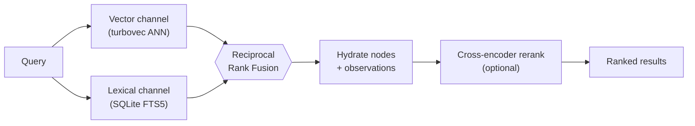

# Turbovec MCP — Long-Term Memory for AI Coding Assistants

A local-first [Model Context Protocol](https://modelcontextprotocol.io) server that gives your AI assistant a persistent memory it can search, traverse and extend across sessions.

Everything runs in-process on your machine: a SQLite knowledge graph, SQLite FTS5 for keyword search, and the `turbovec` vector index for semantic search. No network calls, no external database.

Works with Claude Desktop, Cursor, Cline / Roo Code, Windsurf, Zoo Code, and any other MCP client.

---

## Why

| Problem | What Turbovec does |
| :--- | :--- |
| Pasting whole files into chat burns tokens and degrades reasoning | Stores them once, returns only the relevant chunks |
| Closing a chat loses every decision and convention | Persists entities, relationships and session summaries to disk |
| Keyword search misses anything phrased differently | Runs vector **and** keyword search, then fuses the rankings |
| Saved notes drift into an orphaned, stale pile | A background librarian clusters, links and prunes them |

---

## How retrieval works

A query runs through two independent channels. Their rankings are merged with
Reciprocal Rank Fusion, so no score calibration between them is needed.


```mermaid
graph LR
    Q[Query] --> V["Vector channel<br/>(turbovec ANN)"]
    Q --> L["Lexical channel<br/>(SQLite FTS5)"]
    V --> R{{"Reciprocal<br/>Rank Fusion"}}
    L --> R
    R --> H["Hydrate nodes<br/>+ observations"]
    H --> X["Cross-encoder rerank<br/>(optional)"]
    X --> O[Ranked results]
```

Stored alongside the text is a typed graph — entities, weighted relationships and
timestamped observations — so results can be expanded into their surrounding
context instead of returned as isolated snippets.

---

## Quick start

```bash
git clone https://github.com/henny-bee/Turbovec-MCP-Server.git
cd turbovec-mcp-server

python -m venv venv
source venv/bin/activate        # Windows: .\venv\Scripts\activate
pip install -r requirements.txt

python main.py                  # startup is logged to server.log
```

Then point your MCP client at it — for Claude Desktop, in `claude_desktop_config.json`:

```json
{
  "mcpServers": {
    "turbovec": {
      "command": "/absolute/path/to/venv/bin/python",
      "args": ["/absolute/path/to/main.py"],
      "env": { "PYTHONUNBUFFERED": "1" }
    }
  }
}
```

Use the **absolute path to the venv's Python**, not bare `python` — otherwise your
editor runs the system interpreter and the import fails. Setup for other editors,
Docker and SSE mode is in the [Configuration Guide](docs/configuration.md).

---

## Documentation

| Guide | Contents |
| :--- | :--- |
| [Configuration & Setup](docs/configuration.md) | Editor integration, environment variables, Docker, dashboard, storage schema |
| [Tools Reference](docs/tools_reference.md) | All 35 MCP tools and 2 prompts, by category |
| [Custom Instructions](docs/custom_instructions.md) | Rules that make your assistant use the memory unprompted |
| [Architecture](docs/architecture.md) | Module map, design rules, performance decisions |

---

## Development

```bash
pip install -r requirements-dev.txt
pytest                # 78 unit and integration tests
black .               # formatting, enforced in CI
```

Tests cover graph consistency, transactional rollback, hybrid search ranking,
rank fusion, embedding cache and batching, index persistence, clustering,
semantic radar, and the librarian cycle.

---

## License

MIT — see [LICENSE](LICENSE).

[](https://lobehub.com/mcp/henny-bee-turbovec-mcp-server)
[](https://glama.ai/mcp/servers/henny-bee/Turbovec-MCP-Tiar)
[](https://m8ven.ai/mcp/henny-bee-turbovec-mcp-tiar-1qnnb8)

**Sponsored by**

<a href="https://www.iseekaigo.com/">
  
</a>
