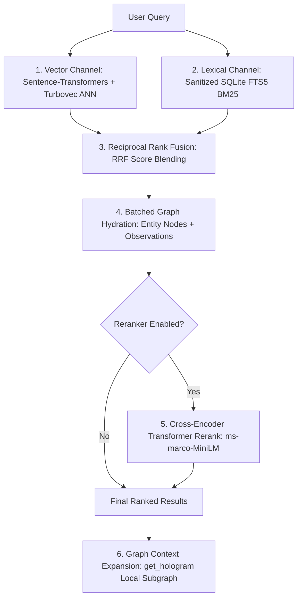

# Turbovec MCP - Long-Term Memory for AI Coding Assistants

[](https://lobehub.com/mcp/henny-bee-turbovec-mcp-server)
[](https://glama.ai/mcp/servers/henny-bee/Turbovec-MCP-Tiar)
[](https://m8ven.ai/mcp/henny-bee-turbovec-mcp-tiar-1qnnb8)
[](LICENSE)
[](https://www.python.org/)
[](docs/architecture.md#testing)

> **Turbovec MCP** is an ultra-fast, local-first [Model Context Protocol (MCP)](https://modelcontextprotocol.io) server that equips your AI assistant with a persistent, autonomous memory across chats, editors, and projects.

Everything runs strictly on your machine — zero network calls, zero external databases, zero cloud dependencies. It seamlessly unifies **vector ANN search** (`turbovec`), **full-text keyword search** (SQLite FTS5), and a **typed knowledge graph** with time travel and background intelligence.

Works out of the box with **Claude Desktop**, **Cursor**, **Cline / Roo Code**, **Windsurf**, **Zoo Code**, and any standard MCP client.

---

## Table of Contents

- [Why Turbovec?](#why-turbovec)
- [Key Features](#key-features)
- [How Retrieval Works](#how-retrieval-works)
- [Quick Start](#quick-start)
- [Client Integration & Configs](#client-integration--configs)
  - [Claude Desktop](#1-claude-desktop)
  - [Cursor](#2-cursor)
  - [Cline / Roo Code](#3-cline--roo-code)
  - [Windsurf](#4-windsurf)
  - [Standalone / SSE Mode](#5-standalone--sse-mode-shared-server)
- [Custom Instructions (Get Assistants to Use Memory)](#custom-instructions-for-ai-assistants)
- [Core Tools Cheatsheet](#core-tools-cheatsheet)
- [Developer Dashboard](#developer-dashboard)
- [Configuration & Environment](#configuration--environment)
- [Documentation](#documentation)
- [Testing & Development](#testing--development)
- [License](#license)

---

## Why Turbovec?

| Problem | What Turbovec Does |
| :--- | :--- |
| **Token bloat & context pollution** | Pasting huge files drains tokens and impairs reasoning. Turbovec stores them once and extracts only the most relevant, context-rich chunks. |
| **Amnesia between sessions** | Closing a chat wipes your decisions and guidelines. Turbovec persists typed entities, weighted relations, and session summaries locally. |
| **Keyword search misses intent** | Exact keywords miss synonyms and rephrased queries. Turbovec fuses **vector semantic search** and **SQLite FTS5 lexical search** via Reciprocal Rank Fusion (RRF). |
| **Stale, fragmented notes** | Manual notes drift into disorganization. An autonomous **background librarian** clusters concepts (DBSCAN), surfaces unlinked ideas, and prunes stale data. |
| **Destructive updates** | Modifying knowledge overwrites past assumptions. Turbovec supports **point-in-time time travel** to audit or diff project history at any timestamp. |

---

## Key Features

- **Hybrid Search with RRF & Reranking**: Combines fast cosine similarity vector search (`turbovec`) and BM25/FTS5 keyword search using Reciprocal Rank Fusion (RRF), with optional cross-encoder reranking.
- **Rich Typed Knowledge Graph**: Entities, weighted relationships, and timestamped observations with ontology enforcement. Traverse entity neighborhoods with one-call `get_hologram`.
- **Time Travel & Timeline Audit**: Every mutation is timestamped. Diff knowledge states between any two points in time or inspect your graph as of any past moment.
- **Autonomous Background Librarian & Radar**: Runs DBSCAN concept clustering, identifies latent relationships (`semantic_radar`), synthesizes new concepts, and flags orphaned nodes without slowing you down.
- **Message Bottles (Cross-Session Hand-offs)**: Leave prioritized, expiring sticky notes for subsequent sessions (e.g. "auth migration halfway done, tests pending").
- **100% Local-First & Private**: In-process SQLite DB + local vector index. No remote vector stores, no external API keys required for core retrieval.

---

## How Retrieval Works

A query evaluated by `search_memory` passes through an orchestrated multi-stage pipeline designed for low latency, high recall, and fail-loud transparency.


```mermaid
graph TD
    Q[User Query] --> VC[1. Vector Channel: Sentence-Transformers + Turbovec ANN]
    Q --> LC[2. Lexical Channel: Sanitized SQLite FTS5 BM25]
    VC --> RRF[3. Reciprocal Rank Fusion: RRF Score Blending]
    LC --> RRF
    RRF --> HYD[4. Batched Graph Hydration: Entity Nodes + Observations]
    HYD --> CE{Reranker Enabled?}
    CE -- Yes --> RERANK[5. Cross-Encoder Transformer Rerank: ms-marco-MiniLM]
    CE -- No --> OUT[Final Ranked Results]
    RERANK --> OUT
    OUT --> EXP[6. Graph Context Expansion: get_hologram Local Subgraph]
```

### Retrieval Stages

1. **Vector Channel (Semantic Search)**
   - The query text is encoded using Sentence-Transformers (`all-MiniLM-L6-v2` at 384 dimensions by default, or `BAAI/bge-m3` at 1024 dimensions).
   - Queries under 4,096 characters hit an in-memory LRU cache (`EMBEDDING_CACHE_SIZE=512`), eliminating model overhead for repeated or overlapping searches.
   - The embedded vector queries the native `turbovec` index (`IdMapIndex`) using cosine distance. An oversampling multiplier (`vector_oversample=5`, minimum 100 candidates) guarantees deep candidate recall.
   - Vector IDs are resolved to entity IDs via `vector_id_mapping` joined with SQLite `nodes` in chunked batches, automatically filtering out archived entities and scoping to the target `project_id`.

2. **Lexical Channel (Exact & Keyword Search)**
   - The query is sanitized via `sanitize_fts_query` to escape syntax characters and prevent malformed query exceptions.
   - SQLite FTS5 executes an exact BM25 lexical match against `entities_fts` (`ORDER BY rank`), targeting entity names, aliases, and indexed property fields.
   - Archived entities are excluded, preserving genuine lexical ranking order.

3. **Reciprocal Rank Fusion (RRF)**
   - The independent rank lists from the vector and lexical channels are combined without fragile score-normalization or scale-matching heuristics.
   - The standard RRF formula is applied:
     $$\text{RRF}(d) = \sum_{c \in \{\text{vector}, \text{lexical}\}} \frac{w_c}{k + \text{rank}_c(d)}$$
     where $k = 60.0$ by default and $w_c$ allows custom channel weighting (e.g., lexical-only or vector-heavy biasing).
   - If cross-encoder reranking is active, the candidate pool expands to `limit * rerank_candidate_multiplier` (default 3x) to give the reranker a wider selection.

4. **Batched Graph Hydration**
   - Candidate entity IDs are hydrated in chunked SQLite queries (`fetch_nodes` and `fetch_observations`), avoiding N+1 round-trips.
   - Hydrates core entity metadata, JSON properties, status, and chronological observations.
   - Increments entity salience counters (`retrieval_count`, `last_retrieved_at`) atomically.

5. **Optional Cross-Encoder Reranking**
   - When `RERANKER_ENABLED=true`, candidate text pairs (query against hydrated entity name, type, and concatenated observations) are evaluated by a cross-encoder model (`cross-encoder/ms-marco-MiniLM-L-6-v2`).
   - Re-sorts candidates based on joint attention scores, significantly improving precision for subtle queries before slicing to the requested `limit`.

6. **Graph Context Expansion**
   - Results provide structured context rather than bare text snippets.
   - Clients can call `get_hologram(node_id, depth=1)` to pull the complete local subgraph — node attributes, weighted relationships, and connected neighbor entities — providing holistic context directly into the AI prompt window.

---

## Quick Start

### 1. Clone & Set Up Environment

```bash
git clone https://github.com/henny-bee/Turbovec-MCP-Tiar.git
cd Turbovec-MCP-Tiar

# Create and activate virtual environment
python -m venv venv

# macOS / Linux:
source venv/bin/activate

# Windows (Command Prompt / PowerShell):
.\venv\Scripts\activate

# Install dependencies
pip install -r requirements.txt
```

### 2. Verify Startup

```bash
python main.py
```
*Startup logs and database initialization are written to `server.log`.*

---

## Client Integration & Configs

> **Crucial:** Always use the **absolute path to your virtual environment's Python**, never a bare `python`. A bare command uses your global system Python and will throw `ModuleNotFoundError`.

### 1. Claude Desktop

Add this to your `claude_desktop_config.json`:
- **macOS**: `~/Library/Application Support/Claude/claude_desktop_config.json`
- **Windows**: `%APPDATA%\Claude\claude_desktop_config.json`

```json
{
  "mcpServers": {
    "turbovec": {
      "command": "/absolute/path/to/Turbovec-MCP-Tiar/venv/bin/python",
      "args": ["/absolute/path/to/Turbovec-MCP-Tiar/main.py"],
      "env": {
        "PYTHONUNBUFFERED": "1",
        "BACKGROUND_DISCOVERY": "true"
      }
    }
  }
}
```
*(On Windows, use forward slashes or escaped backslashes, e.g., `C:/path/to/venv/Scripts/python.exe`)*

---

### 2. Cursor

Navigate to **Cursor Settings -> Features -> MCP -> Add New MCP Server**:

- **Name**: `turbovec`
- **Type**: `command`
- **Command**: `/absolute/path/to/Turbovec-MCP-Tiar/venv/bin/python` *(or `C:/path/to/venv/Scripts/python.exe` on Windows)*
- **Args**: `["/absolute/path/to/Turbovec-MCP-Tiar/main.py"]`

---

### 3. Cline / Roo Code

Open your `cline_mcp_settings.json` (accessible via the MCP tab in the extension settings, or located at `%APPDATA%\Code\User\globalStorage\saoudrizwan.claude-dev\settings\cline_mcp_settings.json` on Windows, or `~/.config/Code/User/globalStorage/saoudrizwan.claude-dev/settings/cline_mcp_settings.json` on Linux):

```json
{
  "mcpServers": {
    "turbovec": {
      "command": "/absolute/path/to/Turbovec-MCP-Tiar/venv/bin/python",
      "args": ["/absolute/path/to/Turbovec-MCP-Tiar/main.py"],
      "env": {
        "PYTHONUNBUFFERED": "1",
        "BACKGROUND_DISCOVERY": "true"
      },
      "disabled": false
    }
  }
}
```
*(On Windows, use forward slashes or escaped backslashes, e.g., `C:/path/to/venv/Scripts/python.exe`)*

---

### 4. Windsurf

Add to `~/.codeium/windsurf/mcp_config.json`:

```json
{
  "mcpServers": {
    "turbovec": {
      "command": "/absolute/path/to/Turbovec-MCP-Tiar/venv/bin/python",
      "args": ["/absolute/path/to/Turbovec-MCP-Tiar/main.py"],
      "env": {
        "PYTHONUNBUFFERED": "1"
      }
    }
  }
}
```
*(On Windows, use forward slashes or escaped backslashes, e.g., `C:/path/to/venv/Scripts/python.exe`)*

---

### 5. Standalone / SSE Mode (Shared Server)

If multiple editors or clients need to share a single memory instance without spawning duplicate processes:

1. Create a `.env` file in the project root:
   ```env
   run_mode=local
   ```
2. Start the server:
   ```bash
   python main.py
   # Serves SSE endpoint on http://localhost:4392/sse
   ```
3. Connect any MCP client via SSE URL:
   ```json
   {
     "mcpServers": {
       "turbovec": {
         "url": "http://localhost:4392/sse"
       }
     }
   }
   ```

## Custom Instructions for AI Assistants

To ensure your assistant actively queries and maintains memory without prompting, add the following snippet to your client's system prompt (e.g., Cursor `.cursorrules`, Cline `.clinerules`, or Claude Desktop Project instructions):

```markdown
# Long-Term Memory Guidelines (Turbovec MCP)

You have access to Turbovec MCP tools for persistent long-term memory across sessions.

1. Session Start:
   - Check unread hand-off notes using `get_bottles()`.
   - Query project context and recent architecture decisions using `search_memory(query="...")`.

2. During Work:
   - When encountering a novel architectural pattern, convention, or domain entity, persist it using `create_entity()` and attach timestamped context using `add_observation()`.
   - Connect related entities using `create_relationship()` with validated relation types from ontology.json.
   - For complete local context of an entity and its neighbors, invoke `get_hologram(node_id="...")`.

3. Session End / Milestones:
   - When completing major milestones or handing off unfinished work, leave a note using `create_bottle(message="...", priority="high")`.
   - Record significant breakthroughs with `record_breakthrough()`.
```

---

## Core Tools Cheatsheet

Turbovec provides 35 specialized MCP tools across distinct functional domains:

| Category | Key Tools | What They Do |
| :--- | :--- | :--- |
| **Search & Retrieval** | `search_memory`, `search_knowledge` | Hybrid vector + FTS5 search (fused via RRF) or pure vector search. |
| **Structured Graph** | `create_entity`, `add_observation`, `create_relationship`, `get_hologram` | Build and traverse the typed graph. `get_hologram` returns an entity plus its entire local neighborhood. |
| **Documents & Files** | `add_knowledge`, `add_file_knowledge`, `delete_knowledge` | Ingest local files or text chunks; auto-embeds and links to the graph. |
| **Time Travel** | `point_in_time_query`, `diff_knowledge_state`, `query_timeline` | Inspect graph state at any timestamp or diff changes between two dates. |
| **Autonomous Radar** | `semantic_radar`, `run_relationship_discovery`, `set_background_discovery` | Discovers latent connections between unlinked entities using vector proximity. |
| **Message Bottles** | `create_bottle`, `get_bottles`, `acknowledge_bottle` | Cross-session hand-off notes and reminders that persist outside the graph. |
| **Sessions & History** | `start_session`, `record_breakthrough`, `end_session` | Track chronological project work units and chain milestones. |
| **Lifecycle & Hygiene** | `archive_entity`, `restore_entity`, `list_orphans`, `prune_stale` | Archive superseded concepts and prune orphaned nodes safely. |
| **Librarian & Admin** | `run_librarian_cycle`, `analyze_graph`, `search_stats`, `optimize_memory` | Autonomous DBSCAN concept clustering, PageRank centrality, and index compaction. |

*(For complete argument schemas and defaults, refer to the [Tools Reference](docs/tools_reference.md).)*

---

## Developer Dashboard

Turbovec includes an interactive **Streamlit dashboard** for visualizing your knowledge graph, monitoring search latency percentiles, and tracking background librarian cycles.

```bash
pip install -r requirements-dashboard.txt
streamlit run dashboard/app.py
```
Open **`http://localhost:8501`** in your browser. Reads directly from your local `memory.db`.

---

## Configuration & Environment

Tune behavior via `.env` or your MCP client's `env` block. Key settings include:

| Variable | Default | Purpose |
| :--- | :--- | :--- |
| `run_mode` | *(unset)* | Set to `local` to enable standalone SSE mode on port `4392`. |
| `BACKGROUND_DISCOVERY` | `false` | Run background daemon to discover unlinked relationships. |
| `BG_DISCOVERY_INTERVAL` | `300` | Discovery daemon interval in seconds. |
| `EMBEDDING_PROVIDER` | `minilm` | Embedding backend: `minilm` (384d, ultra-fast) or `bge` (1024d). |
| `RRF_K` | `60.0` | Reciprocal Rank Fusion smoothing constant. |
| `RERANKER_ENABLED` | `false` | Set `true` to enable cross-encoder reranking. |
| `SQLITE_DB_FILE` | `memory.db` | SQLite database file path. |
| `INDEX_FILE` | `index.tvim` | Turbovec vector index file path. |

*(Full reference available in the [Configuration Guide](docs/configuration.md).)*

---

## Documentation

| Guide | Description |
| :--- | :--- |
| [Configuration & Setup](docs/configuration.md) | In-depth setup, Docker instructions, environment variables, and SQLite storage schema. |
| [Tools Reference](docs/tools_reference.md) | Exhaustive parameter reference for all 35 tools and 2 prompt templates. |
| [Custom Instructions](docs/custom_instructions.md) | System prompt templates to ensure assistants use memory consistently. |
| [Architecture & Performance](docs/architecture.md) | Architectural layout, performance benchmarks, and design decisions. |

---

## Testing & Development

Run the test suite with `pytest`:

```bash
pip install -r requirements-dev.txt

# Run all 78 unit & integration tests
pytest

# Enforce code style
black .
```

Docker deployment is also supported:

```bash
docker-compose up -d
```

---

## License

Distributed under the **MIT License**. See [LICENSE](LICENSE) for details.

---
